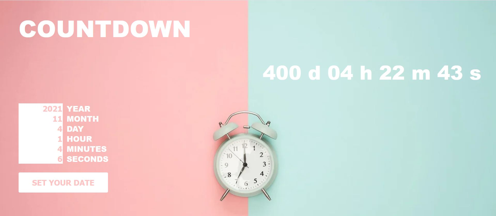

# Countdown Clock

> Customized countdown clock

### Insert your customized data and click the SET YOUR DATE button to start the countdown ###

### If inputs are not correct an alert will be displayed ###

- If input is not a number an alert will remind you to set the input correctly
- If inputs are incorrect (for example days over 31, hours over 23, etc) an alert will remind you to set the input correctly
- If input year is an year from the past an alert will remind you to set current year or future years
- If input date is already expired an alert will remind you to set the input correctly
 
 ### Once input are set and countdown has started it will be displayed on the right ###
 
 
 ### When the deadline expires a text will be display
 
---

